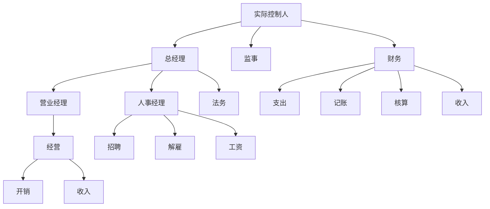

# 公司顶层设计

```mermaid

graph TD
A[实际控制人]
A --> B[总经理]


B --> C2[营业经理]
	C2 --> C21[经营]
		C21 --> C211[开销]
		C21 --> C212[收入]
B --> C3[人事经理]
  C3 --> C31[招聘]
  C3 --> C32[解雇]
  C3 --> C33[工资]

  
B --> C5[法务]

A --> C1[监事]
A --> C4[财务]
	C4 --> C43[支出]
  C4 --> C41[记账]
  C4 --> C42[核算]
  C4 --> C44[收入]
```

